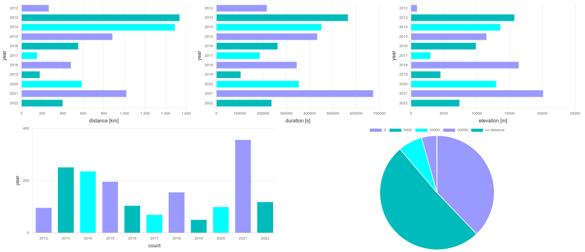
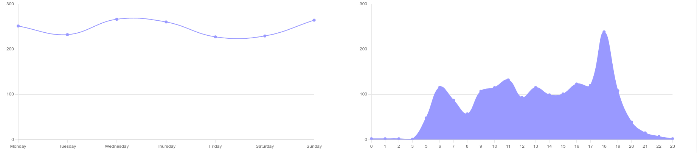

# mystats
Small rails application to render stats nicely

# Usage

Use [mongo_cpp](https://github.com/TheWudu/mongo_cpp/) to import sessions to the database.

Start rails 

```
rails s
```

and visit

```
http://localhost:3000/charts/index
```

You should see something like this:




# Supported Filters

Currently following filters are supported (if applicable for the chart)

* *year*, e.g. `year=2020,2021,2022` for the last 3 years
* *sport_type_id*, e.g. `sport_type_id=1,19` for running and walking
* *group_by*, e.g. `group_by=year,month` or `group_by=sport_type_id`, defaults to `year`
