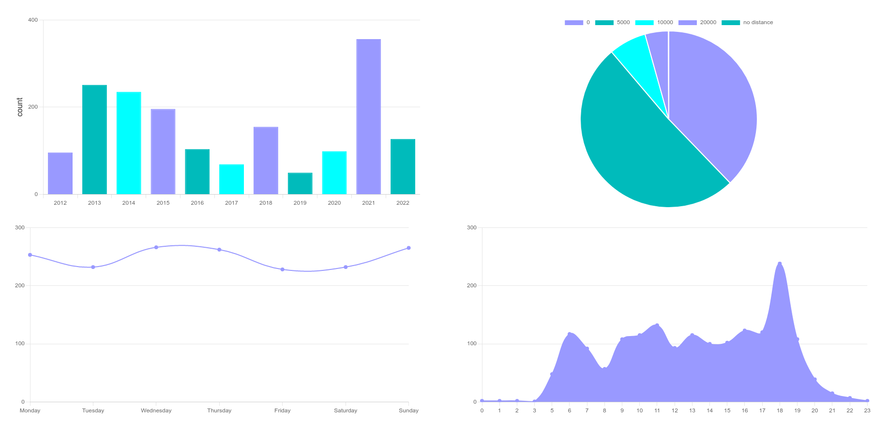

# mystats
Small rails application to render stats nicely

# Usage

Use [mongo_cpp](https://github.com/TheWudu/mongo_cpp/) to import sessions to the database.

Start rails 

```
rails s
```

## Pages

### Statistics

To view statistics visit

```
http://localhost:3000/charts
```

You should see something like this, depending on your data and your filters:




### Sessions

To view sessions overview visit

```
http://localhost:3000/sessions
```

You should see something like this, depending on your data and your filters:


### Cities

To view a list of imported cities (which are used for timezone finding) visit

```
http://localhost:3000/cities
```

You can also filter by Name (regex search), lat/lng (nearby), or timezone, or valid
combinations.


# Supported Filters

Currently following filters are supported (if applicable for the chart or sessions)

* *year*, e.g. `year=2020,2021,2022` for the last 3 years
* *month*, e.g. `month=1,2,7` for the january, feburary, july
* *sport_type_id*, e.g. `sport_type_id=1,19` for running and walking
* *group_by*, e.g. `group_by=year,month` or `group_by=sport_type_id`, defaults to `year`
